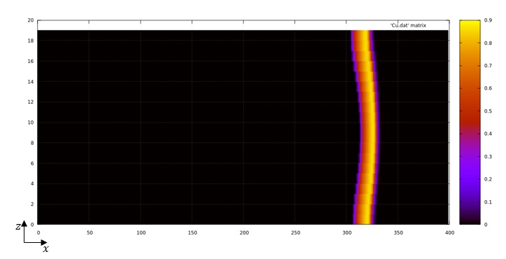
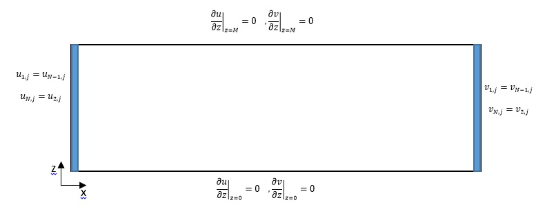

# Caracterización de ondas químicas en flujo laminar (BZ - Poiseuille)

---

## 🧪 Descripción general

Este proyecto tiene como objetivo estudiar el comportamiento de las ondas químicas generadas por la reacción de Belousov-Zhabotinsky (BZ) en presencia de un **flujo laminar tipo Poiseuille** dentro de una **caja rectangular** con:

- Condiciones **periódicas** en los bordes izquierdo y derecho.
- Condiciones de **no flujo** en la tapa y la base.




El modelo se basa en el **Oregonator de dos variables**, incluyendo términos de advección y una implementación numérica en **Fortran**, con análisis posterior en **Python**.

---

## 🎯 Objetivos específicos

- Analizar la **velocidad de propagación**, deformación y estabilidad de los frentes químicos bajo flujo laminar.
- Comparar diferentes tamaños de caja y condiciones iniciales para identificar simetrías, inestabilidades y patrones emergentes.
- Implementar condiciones iniciales coherentes con pulsos químicos autocatalíticos en un entorno numérico estable.

---

## 🔧 Herramientas utilizadas

- Lenguaje de simulación: **Fortran 90** (modelo Oregonator + advección)
- Análisis y visualización: **Python 3**, con bibliotecas como `numpy`, `matplotlib`, `h5py`
- Formato de salida de datos: **HDF5**
- Documentación: **Markdown, LaTeX**
- Control de versiones: **Git + GitHub**

---

## Pasos para correr el codigo.
### Condiciones iniciales
    - el codigo esta en el Bz_condiciones_iniciales.f90
    - cambia el comentario segun la necesidad de si se usa o no OMP
    - en el caso de usar es OMP el sistema debe usarse como:
        gfortran -fopenmp -O3 -o CI Bz_condiciones_iniciales.90
        export OMP_NUM_THREADS=4   # o el número de núcleos que tengas
        ./CI
    - en linux para verificar si es esta usando o no los nucleos se puede usar en la terminal nproc

---

## 📁 Estructura del repositorio

```bash
caracterizacion-bz-poiseuille/
├── README.md           # Esta descripción general del proyecto
├── TODO.md             # Tareas pendientes, mejoras y bugs conocidos
├── diario.md           # Bitácora personal de desarrollo y hallazgos
├── CHANGELOG.md        # Historial de cambios estructurados
├── LICENSE             # Licencia del proyecto (MIT)
├── src/                # Códigos fuente en Fortran
├── scripts/            # Scripts en Python para análisis y visualización
├── output/             # Archivos de salida (datos simulados) - NO SE SUBEN a GitHub
├── figs/               # Figuras y gráficas generadas
├── doc/                # Documentos, borradores, artículos científicos
└── notebooks/          # Jupyter Notebooks explicativos y análisis interactivo


